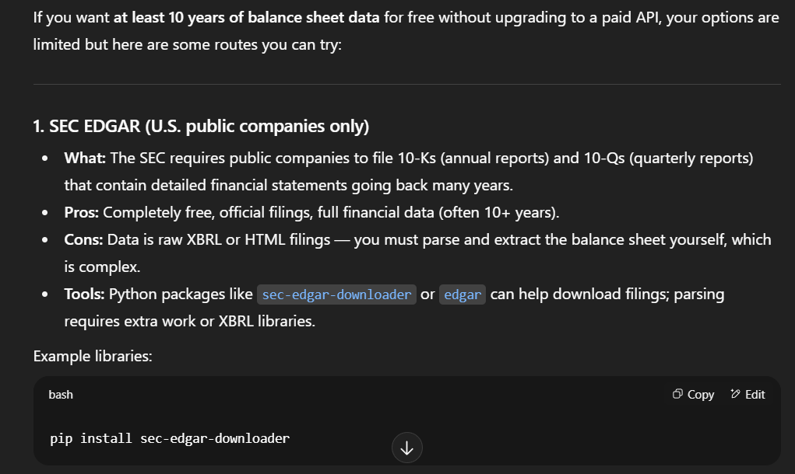

# Stonks

### General Notes:
- Initial research into finance APIs seems to say that alpaca and polygon.io free versions may not be as easy to access and have a API query/minute restriction?
- Currently using yfinance, but open to any other APIs that we think will work. Seems to be pretty beginner-friendly...
- Other options discussed here: 
  - https://medium.com/@trading.dude/beyond-yfinance-comparing-the-best-financial-data-apis-for-traders-and-developers-06a3b8bc07e2
- I think for now we can use yfinance to build out functionality, but eventually we may want to be able to pull in mmore than the 4 years of data that yfinance provides. May be able to pull from this SEC python toolset but may require additional parsing:

- Another option is to webscrape from  quickfs.com which I have used for some data before. I have a test program with my username and password which seems to work, but I need to figure out how to pull the data I actually need...
  - Nevermind, it's apparently "illegal" - they offer their own API and pro version. Bastards....
  - Although there is a GitHub repo for a tool that seems opensource: https://github.com/LautaroParada/quickfs/blob/main/quickfs/quickfs.py
  - Still might not be able to query anything since they impose limits (need to test that out)

### Data to pull from yfinance (or similar)

- 12-month trailing (TTM) EPS (Earnings Per Share)
- 5-year equity growth rate 
  - Pull 'Liabilities & Equity' from the bottom of the company's Balance Sheet
  - Need to use the CAGR (Compound Annual Growth Rate) of start and end points 
  

- Analyst 5-year growth estimate from Yahoo Finance
  - New problem: Yahoo Finance no longer provides their Analyst projections. Not a deal-breaker, it was mainly used to a dose of conservatism. We can work without this for now

- 5 year min and max P/E (Profit-to-Earnings) ratios 
  - I used to pull these directly from MSN Money, but now they are in a graphic that makes it hard to scrape and it looks like the free APIs don't have a good way to pull them. I think we may be able to directly calculate these with a little work. We'll have to talk about this one in more detail later 

That should be a good starting place - we can go over actual calculation stuff next time

